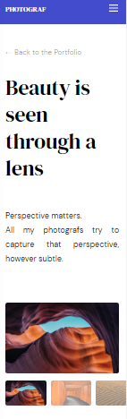
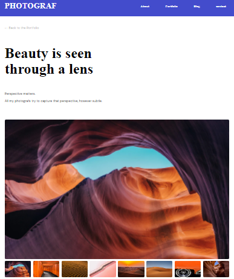

# Photograph

### Where you can see my demo
  You can find my demo below:
  
  [Demo](https://prisca-photograph.netlify.app/)

## Overview



### Built With
 - [HTML](https://developer.mozilla.org/en-US/docs/Web/HTML)
 - [SASS](https://sass-lang.com/)
 - [JavaScript](https://javascript.info/)
 - [Figma](https://www.figma.com/file/VgF87mULloYb7HZ1EMCRzU/Laaqiq-1---Portfolio-detail-(Responsive)?node-id=7%3A16)
 
### Features
- I have a JS file where I coded the slider images 
- I have a Header file where I styled the header of the website
- I have a Navigation file where I toggle the links in the mobile and show all of them in desktop.

## Getting started
To clone and run this application, you'll need [Git](https://git-scm.com) and [Node.js](https://nodejs.org/en/download/) (which comes with [npm](http://npmjs.com)) installed on your computer. From your command line:

```bash
# Clone this repository
$ git clone https://github.com/ravinalamada/vanila-js-birthday-app

# Install dependencies
$ npm install

# Run the app
$ npm start
```
## Contact
-  [Github](https://github.com/ravinalamada)
